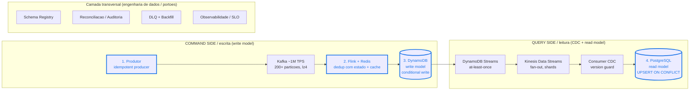

# Handoff: deduplicação de mensagens em pipeline Kafka (~1M TPS) para DynamoDB + CQRS/CDC para PostgreSQL

- Data: 2026-06-19
- Origem: análise de arquitetura (estudo). Síntese de 5 especialistas (Kafka/streaming, DynamoDB, CDC/CQRS/Postgres, design de chave, engenharia de dados end-to-end), com validação de números atuais via busca web.
- Status: recomendação fechada. Custos são estimativa de ordem de grandeza; validar com pricing atual e carga simulada antes de comitar orçamento.
- Convenção: [verificado] = confirmado em fonte; [estimativa] = ordem de grandeza a validar.

## 1. Problema

Eliminar duplicação de mensagens ponta a ponta num pipeline de eventos financeiros de altíssimo volume. Duplicata é o estado normal, não a exceção: Kafka é at-least-once por construção. Fontes de duplicata:

- Retry de producer (sem idempotência configurada).
- Rebalance de consumer e commit de offset após a gravação.
- Reprocessamento e replay (DLQ, reset de offset).
- Duplicata de negócio na origem (ex: clique duplo, retry de aplicação).

Distinção que orienta tudo: duplicata de transporte (infra) vs duplicata de negócio (mesma operação emitida duas vezes). As duas precisam de tratamento, em camadas diferentes.

## 2. Premissa de topologia (assumida)

Kafka é o backbone. Consumidores gravam no DynamoDB (write/command side do CQRS). O CDC (DynamoDB Streams para Kinesis para consumer) projeta para o PostgreSQL (read/query side).

Ponto crítico: Exactly-Once Semantics (EOS) do Kafka resolve Kafka-para-Kafka, mas NÃO cobre sink externo (DynamoDB/PostgreSQL), porque não existe transação distribuída entre Kafka e o sink. [verificado] Logo, a deduplicação vive no fluxo e no estado, não no broker.

## 3. Decisão central: a chave única de idempotência

Ordem de preferência para definir a chave:

1. Idempotency key gerada na origem (melhor caso). O produtor emite um event_id por evento de negócio, estável através de retries, viajando no envelope por todas as camadas. Usar UUIDv7 ou ULID, não UUIDv4: ambos são ordenáveis no tempo, o que elimina hot-partition no DynamoDB e melhora o B-tree do PostgreSQL. [verificado: UUIDv7 nativo no PostgreSQL 17+; ULID 26 chars base32]
2. Business/natural key, se a origem já garante unicidade: transaction_id, ou composta account_id + operation_type + sequence. Direto, sem hash.
3. Hash canônico, só se não houver ID confiável: selecionar 4 a 6 campos de identidade (dos 40), canonicalizar com RFC 8785 / JSON Canonicalization Scheme (ordena chaves, normaliza tipos e encoding) e aplicar SHA-256. Documentar e versionar a lista de campos. [verificado: RFC 8785]

Anti-pattern (foi a ideia inicial e é a armadilha clássica): hash cego dos 40 atributos. Dois modos de falha fatais em banco:

- Falso-positivo (colisão semântica): dois saques legítimos de R$ 100,00 da mesma conta no mesmo segundo geram o mesmo hash. Um evento real é descartado. Perda de dinheiro ou fraude.
- Falso-negativo: um campo volátil (timestamp de ingestão, offset, trace_id) entra no hash. A duplicata real chega com hash diferente e passa. A dedup falha exatamente onde precisa funcionar.

Regra de ouro: separar campos de identidade (entram na chave, imutáveis) de campos mutáveis/voláteis (os outros ~35, fora da chave). A MESMA chave ancora as quatro defesas abaixo. Chaves diferentes entre camadas = a dedup do Kafka não cobre a duplicata do PostgreSQL.

## 4. Arquitetura: defesa em profundidade (4 pontos, mesma chave)



Legenda: nós em destaque (1 a 4) são os pontos de deduplicação, todos ancorados na mesma chave.

| # | Onde | Técnica | Cobre | Veredito |
|---|------|---------|-------|----------|
| 1 | Producer | enable.idempotence=true, acks=all | Retry de producer (transporte) | Obrigatório, custo zero. Pré-requisito, não solução completa. |
| 2 | Stream (Flink) + Redis | Estado com janela (RocksDB) e/ou SET NX + TTL | Reprocessamento, rebalance, dup em janela | Flink é o ponto de controle ideal (estado gerenciado, checkpoint). Redis como pré-filtro barato pra abater write no Dynamo. |
| 3 | DynamoDB | PutItem com ConditionExpression attribute_not_exists(PK) | Idempotência forte no estado | Linha que o EOS não cobre. Trate ConditionalCheckFailedException como duplicata e descarte. Inviolável. |
| 4 | PostgreSQL | INSERT ... ON CONFLICT (chave) DO UPDATE WHERE version < EXCLUDED.version | Dup do próprio CDC + evento fora de ordem | O version guard no WHERE protege contra late-arriving regredir o estado. |

Por que as quatro e não só uma: cada salto entre componentes tem semântica de entrega diferente, e a duplicata nasce nas costuras. Uma camada só deixa buraco na fronteira seguinte.

## 5. Opinião por solução (as opções em jogo)

- EOS / Kafka Transactions como solução de dedup: não usar para este caso. Funciona Kafka-para-Kafka, não para sink externo. Quem promete exactly-once com Dynamo/Postgres está vendendo ilusão.
- Só conditional write no DynamoDB (sem Redis): correto e durável, mas caro. A ~1M TPS, conditional write em item de 40 atributos pode passar de US$ 150k/dia [estimativa]. Funciona, mas o financeiro barra.
- Redis SET NX como dedup principal: rápido, mas não é durável (cai, perde a janela) e o hop de rede a 1M TPS vira gargalo sem cluster dedicado. Bom como pré-filtro, ruim como fonte de verdade.
- Dedup stateful no Flink: robusto e comprovado nesse throughput, mas o estado cresce com a janela (1M TPS x 10 min = ~600M chaves). Janela curta (5 a 15 min) e backend em disco/S3.
- Bloom filter: atraente pela memória, mas tem falso-positivo. Em banco, falso-positivo = descartar evento legítimo. Só como pré-filtro antes de checagem definitiva, nunca sozinho.
- Outbox pattern: padrão certo quando a fonte de verdade é relacional. Aqui a fonte é o DynamoDB, então o caminho é Dynamo para CDC. Outbox entraria se o write side fosse um banco SQL.

## 6. O olhar de banco (volumetria absurda)

Dois pontos que separam slide de produção em fintech:

1. Custo mora no DynamoDB WCU. Alavancas em ordem de impacto: pré-filtro Redis abatendo duplicatas antes do write; guardar só a chave no Dynamo (payload vai pra Postgres/S3, reduz WCU por item); provisioned + auto-scaling pra carga flat em vez de on-demand; TTL pra expirar marcadores de dedup. Com isso a estimativa cai pra faixa de US$ 50k/dia [estimativa]. Pedir aumento de quota antes do go-live: o default de tabela (40k WCU) não chega perto de 1M TPS. [verificado]
2. PostgreSQL não é 1:1 com o evento. 1M INSERT/s single-node é inviável (teto prático ~100k-200k/s com COPY). O read model é projeção (estado atual por entidade), então o volume real de escrita é entidades únicas atualizadas/s, ordens de magnitude menor. Se precisar de volume bruto: particionar por tempo (pg_partman) e, no limite, Citus.

Portão inviolável (vale o rigor de fechamento financeiro): "a soma fechar" não é validação. Provar que não duplicou E não perdeu, com:

- Reconciliação por janela: COUNT ponta a ponta Kafka vs DynamoDB vs PostgreSQL, tolerância zero nos campos financeiros.
- Tabela de auditoria append-only com event_id, para caçar duplicata.
- Checksum de controle (hash de valor + conta) verificado na escrita do read model; divergência vai pra DLQ.

## 7. Snippets de referência

Producer (config mínima):

```properties
enable.idempotence=true
acks=all
retries=2147483647
max.in.flight.requests.per.connection=5
compression.type=lz4
```

DynamoDB conditional write (Python / boto3):

```python
try:
    table.put_item(
        Item={"pk": idem_key, "sk": op_key, "payload": payload, "ttl": now + 7 * 86400},
        ConditionExpression="attribute_not_exists(pk)",
    )
except ClientError as e:
    if e.response["Error"]["Code"] == "ConditionalCheckFailedException":
        metrics.increment("duplicates_discarded")  # duplicata confirmada: descarta limpo
        return
    raise  # throttle/network: deixa re-enfileirar (NAO comitar offset)
```

PostgreSQL UPSERT idempotente com version guard:

```sql
INSERT INTO read_model (idem_key, entity_id, version, payload, updated_at)
VALUES (:idem_key, :entity_id, :version, :payload, now())
ON CONFLICT (idem_key) DO UPDATE
   SET payload    = EXCLUDED.payload,
       version    = EXCLUDED.version,
       updated_at = EXCLUDED.updated_at
 WHERE read_model.version < EXCLUDED.version;  -- barra regressao por evento fora de ordem
```

Reconciliação (consulta de duplicata, esperado 0 linhas):

```sql
SELECT idem_key, COUNT(*)
FROM   audit_log
GROUP  BY idem_key
HAVING COUNT(*) > 1;
```

## 8. Recomendação fechada (ordem de execução)

1. event_id UUIDv7/ULID na origem, no envelope, imutável. Maior alavancagem da arquitetura inteira.
2. Idempotent producer ligado (custo zero).
3. Flink com janela de dedup curta + Redis SET NX como pré-filtro pra proteger o custo do Dynamo.
4. DynamoDB conditional write como gate forte de estado; guardar só a chave + TTL.
5. CDC via Streams para Kinesis para consumer, com UPSERT ON CONFLICT + version guard no PostgreSQL.
6. Schema Registry (AWS Glue, já que a stack é AWS) com campos de identidade congelados e compatibilidade BACKWARD_TRANSITIVE. [verificado: AWS Glue Schema Registry suporta Avro/Protobuf]
7. Reconciliação ponta a ponta + DLQ com replay idempotente + OpenTelemetry com SLO escrito (lag, dup_rate, dlq_depth, p99).

## 9. Checklist do "pronto" (não chamar de pronto sem isto)

- [ ] Mesma chave de idempotência confirmada no producer, no schema, no consumer Flink, no conditional write Dynamo e no UNIQUE do Postgres.
- [ ] Tabela de auditoria append-only + job de reconciliação COUNT por janela rodando.
- [ ] DLQ com header de chave preservado e runbook de replay idempotente.
- [ ] FinOps do DynamoDB estimado com Redis absorvendo o burst, validado com carga simulada.
- [ ] OpenTelemetry ponta a ponta com SLO definido por escrito e alarmes.
- [ ] Schema Registry com BACKWARD_TRANSITIVE e campos de identidade congelados.
- [ ] Quota increase do DynamoDB solicitado antes do go-live.

## 10. Referências (verificadas via busca, 2025-2026)

- Confluent: Exactly-Once Semantics in Apache Kafka. https://www.confluent.io/blog/exactly-once-semantics-are-possible-heres-how-apache-kafka-does-it/
- Ververica: Stream processing with high cardinality and large state (Klaviyo). https://www.ververica.com/blog/stream-processing-with-high-cardinality-and-large-state-at-klaviyo
- AWS: Quotas in Amazon DynamoDB. https://docs.aws.amazon.com/amazondynamodb/latest/developerguide/ServiceQuotas.html
- AWS: New Amazon DynamoDB lowers pricing for on-demand throughput. https://aws.amazon.com/blogs/database/new-amazon-dynamodb-lowers-pricing-for-on-demand-throughput-and-global-tables/
- AWS: DynamoDB Streams Kinesis adapter. https://docs.aws.amazon.com/amazondynamodb/latest/developerguide/Streams.KCLAdapter.html
- PostgreSQL: INSERT (ON CONFLICT). https://www.postgresql.org/docs/current/sql-insert.html
- Gunnar Morling: On Idempotency Keys. https://www.morling.dev/blog/on-idempotency-keys/
- RFC 8785 / JSON Canonicalization Scheme. https://datatracker.ietf.org/doc/html/rfc8785
- AutoMQ: Kafka Schema Registry (Confluent vs AWS Glue) 2026. https://www.automq.com/blog/kafka-schema-registry-confluent-aws-glue-redpanda-apicurio-2025

## 11. Procedência e ressalvas

- Síntese gerada por análise multi-agente (5 especialistas), validada contra fontes públicas atuais.
- Números de custo (US$ 150k/dia, US$ 50k/dia) são estimativa de ordem de grandeza derivada de premissas (3 WCU/item, ~1M TPS sustentado). Recalcular com tamanho real do item, taxa real de duplicata e pricing vigente.
- Topologia assumida (Kafka para Dynamo write side para CDC para Postgres read side). Se a real for diferente (ex: dois sinks paralelos a partir do Kafka), revisar onde a chave ancora.
