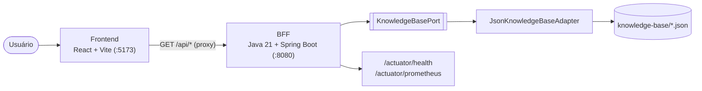

# Architecture — System Design Specialist Lab

Documento da arquitetura **do próprio Lab** (não dos sistemas estudados — esses estão
em `system-design-knowledge-map.md`).

## Visão geral



Três peças, uma fonte de verdade (`knowledge-base/*.json`):
1. **Frontend** — navega e renderiza (Mermaid, markdown). Sem regra de negócio.
2. **BFF** — expõe a base como API REST estável; é o ponto de composição/validação.
3. **Knowledge base** — JSON versionado, validado por schema e por teste de integridade.

## Por que um BFF (e não o front lendo o JSON direto)

É o padrão **Backend for Frontend** aplicado a nós mesmos: o front fala com **uma** API
sob medida, o BFF esconde o formato de armazenamento (hoje JSON, amanhã um banco — o
front não muda), valida entrada, padroniza erros, e expõe health/métricas. Isso também
torna o Lab um **exemplo vivo** de um dos padrões que ele ensina.

## BFF — arquitetura hexagonal (ports & adapters)

```
io.systemdesign.lab
├── domain
│   ├── model/         Topic, Pattern, Flow, InterviewQuestion, Diagram, Evidence,
│   │                  SourceRef, TradeOff   (records puros, SEM anotação de framework)
│   └── port/          KnowledgeBasePort     (porta de saída — interface do domínio)
├── application
│   ├── KnowledgeService          (casos de uso: listar / buscar por id / stats)
│   └── ResourceNotFoundException (erro de domínio)
└── infrastructure
    ├── web/           Controllers (entrada) + GlobalExceptionHandler + RequestIdFilter + dto/
    ├── persistence/   JsonKnowledgeBaseAdapter  (implementa a porta — lê JSON)
    └── config/        WebConfig (CORS)
```

**Regra de dependência:** tudo aponta para dentro. O `domain` não conhece Spring, JSON
nem HTTP. O adapter de saída (`JsonKnowledgeBaseAdapter`) depende do domínio
(implementa `KnowledgeBasePort`), nunca o contrário. Trocar a fonte de dados (JSON →
Postgres) é escrever um novo adapter; nada do domínio/aplicação muda.

**DTOs separados do domínio:** os endpoints de **lista** devolvem DTOs de resumo
(`TopicSummary`, …) — sem os campos longos (`detailedExplanation`). Os endpoints de
**detalhe** devolvem o objeto de domínio completo. Isso evita trafegar texto pesado em
listagens e mantém a fronteira web explícita.

**Por que records sem anotações Jackson:** o `ObjectMapper` do Spring tem o
`ParameterNamesModule` e o compilador roda com `-parameters`, então os records são
desserializados pelos nomes dos componentes — o domínio fica livre de framework
(princípio da arquitetura limpa).

## Knowledge base — o contrato

`knowledge-base/schema/knowledge-base.schema.json` (JSON Schema 2020-12) é o **contrato**
que o BFF desserializa e o frontend consome. Cada item carrega `sourceRefs[]`
(≥1, invariante). O pipeline:

```
docs/_sources/  (PDF extraído + resumos)  ──┐
                                            ├─►  agentes geram  knowledge-base/_parts/*.json
microservices.io + repos  ──────────────────┘
                          │
scripts/merge_validate_kb.py  ──►  knowledge-base/*.json   (merge + validação de schema)
                          │
bff KnowledgeBaseIntegrityTest  ──►  falha o build se faltar fonte / cross-ref quebrar
```

No build do BFF, o Maven copia `../knowledge-base/*.json` para o classpath
(`target/classes/knowledge-base/`), então o jar é autossuficiente. Em dev dá para
apontar para arquivos vivos com `SDSL_KNOWLEDGE_BASE_DIR=../knowledge-base`.

## Frontend

- **React + Vite + TypeScript** (strict). Roteamento `react-router-dom`.
- `src/api.ts` — cliente tipado (tipos espelham o domínio do BFF).
- Componentes reutilizáveis: `Mermaid` (render de diagrama), `Markdown`, `SourceRefList`
  (links para repos/microservices.io), `TradeOffTable`, `Chips`, `DiagramEmbeds`.
- Em dev, o Vite faz **proxy** de `/api` e `/actuator` para `:8080` (uma origem só, sem
  CORS). O BFF também tem CORS configurado como rede de segurança.

## Qualidade / observabilidade

- **Testes:** unit (`KnowledgeServiceTest`), contrato HTTP (`ApiContractTest`,
  MockMvc), e **integridade** (`KnowledgeBaseIntegrityTest`: toda afirmação tem fonte,
  cross-refs resolvem, 18+ padrões presentes, ≥30 perguntas).
- **Erros:** `GlobalExceptionHandler` → corpo `ApiError` uniforme (404 / 400 / 500).
- **Logs:** `RequestIdFilter` injeta `requestId` no MDC (header `X-Request-Id`).
- **Métricas:** Actuator + Micrometer/Prometheus em `/actuator/prometheus`.

## Trade-offs desta arquitetura

| Decisão | Ganho | Custo |
|---------|-------|-------|
| JSON em memória (sem DB) | simples, zero infra, determinístico, versionável em git | sem query rica; recarrega só no boot |
| BFF Java só de leitura | API estável + exemplo do padrão BFF | uma peça a mais para rodar vs. front lendo JSON |
| Conteúdo gerado por agentes + validação | escala de conteúdo com rastreio de fonte | exige o gate de integridade para não “inventar” |
